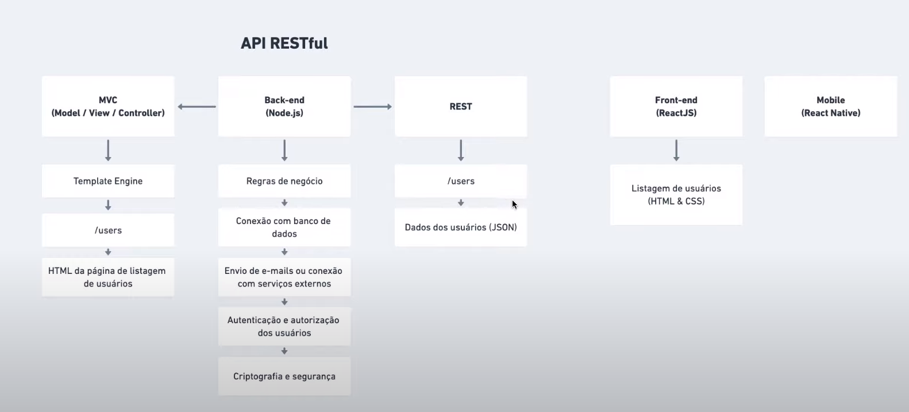
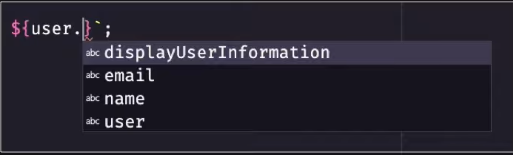
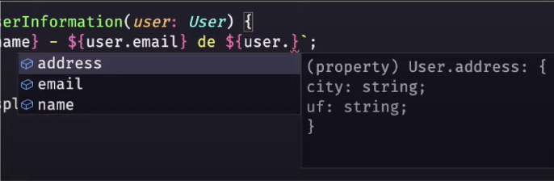
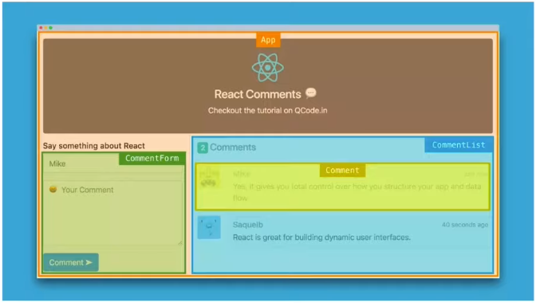
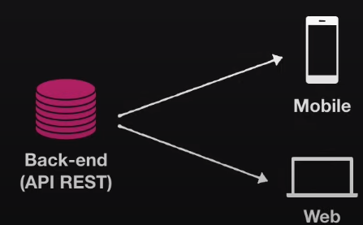
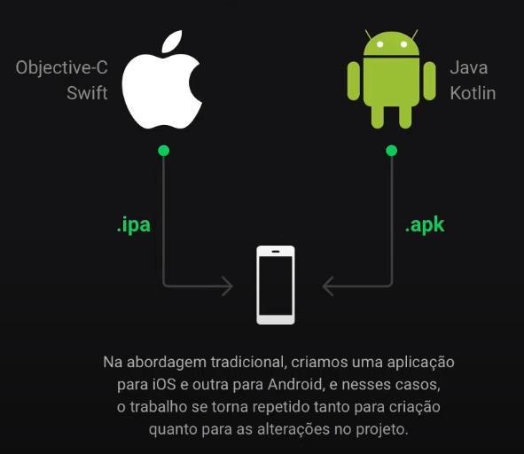
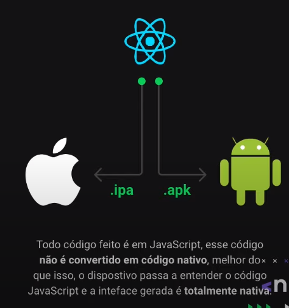
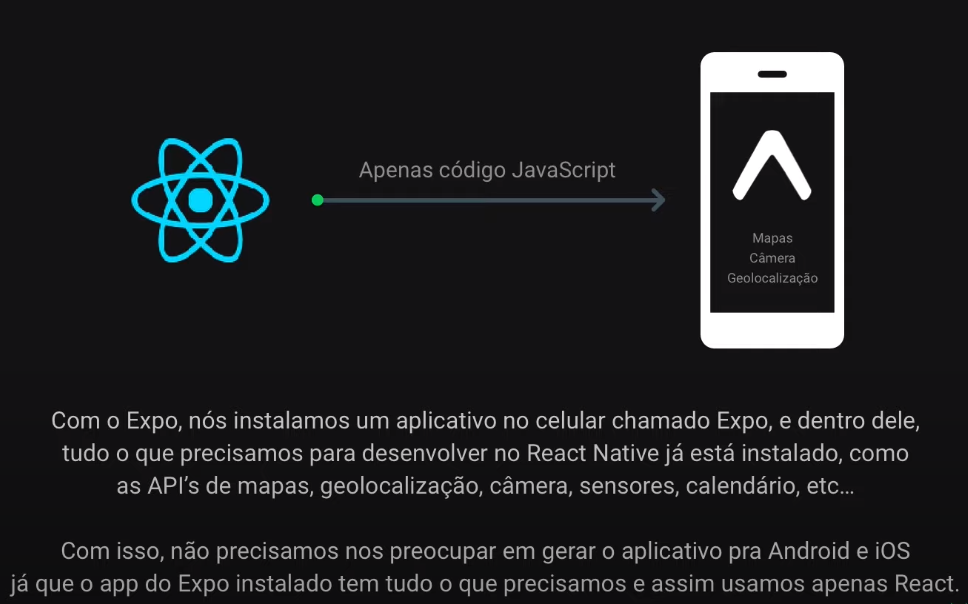

<h1 align="center">Next Level Week #1</h1>

# Dia 1

## Por que criaremos uma API?
<p align="center">
  
</p>

## Conceitos de Typescript
### Por que TypeScript?
`javascript`
```javascript
/**
 * Função que exibe dados do usuário
 */
function displayUserInformation(user) {
  return `${user.name} - ${user.email}`;
}

export default displayUserInformation;
```
Novo dev, **Desafio**: incluir a informação da cidade e UF do usuário nesse retorno.
  - Qual o formato do objeto de usuário
  - Utilizo `user.city` ou `user.address.city`?
  - Será que a cidade e UF são obrigatórias?

### IntelliSense
- Inteligencia da IDE
- O editor não conhece o formato da variável user e, por isso, não consegue determinar suas propriedades.
<p align="center">
  
</p>
- Nesse caso, o editor consegue saber exatamente os dados que um usuário pode ter e oferecer inteligência de IDE.
<p align="center">
  
</p>

### Mitos e verdades
- ✔ TypeScript diminui a produtividade
- ❌ TypeScript é transformar JavaScript em Java ou C#
- ❌ O mercado não usa TypeScript
- ❌ TypeScript substitui o JavaScript por completo
- ✔❌ TypeScript atrapalha quem é iniciante


## 💙 Sobre React
- Biblioteca para construção de interfaces;
- Utilizado para construção de Single-Page-Applications (SPA);
- Podemos chamar de framework? sim e Não
- Tudo fica dentro do JavaScript;
- React / ReactJS / React Native;
- [React+TypeScript Cheatsheets](https://github.com/typescript-cheatsheets/react-typescript-cheatsheet)

### Vantagens
- Organização do código;
  - Componentização;

<p align="center">
  
</p>

- Divisão de responsabilidades;
  - Back-end: Regra de negócio
  - Front-end: Interface

- Uma API, múltiplos clientes;

<p align="center">
  
</p>

## 💙 Entendendo o React Native

- Abordagem tradicional

<p align="center">
  
</p>

- Abordagem do React Native

<p align="center">
  
</p>

## Por que utilizaremos o Expo?

<p align="center">
  
</p>

## Arquitetura do Expo

<p align="center">
  
</p>

## 🚀 Iniciando back-end
```sh
mkdir server
cd server
npm init -y
npm install express
npm install typescript -D
# como o projeto irá ser em typescript
# devemos instalar caso necessário as definições de tipos
npm install @types/express -D
# como o node não compreende o typescript
# devemos instalar o pacote que realiza essa conversão
npm install ts-node -D
# npx execute um pacote que foi instalado no projeto
npx ts-node src/server.ts
# deve existir o arquivo de configuração do typescript, caso nao execute o comando abaixo
npx tsc --init
# pacote do ts para hot reload
npm install ts-node-dev -D
npx ts-node-dev src/server.ts
```

## 🚀 Iniciando front-end

```sh
npx create-react-app web --template=typescript
```

# Dia 2

## Explicando conceitos

### Rotas e recursos

  - Rota: Endereço completo da requisição.
  - Recurso: Qual entidade estamos acessando do sistema.

### Métodos HTTP

- GET: Buscar uma ou mais informações do back-end
- POST: Criar uma nova informação no back-end
- PUT: Atualizar uma informação existente no back-end
- DELETE: Remover uma informação do back-end

- exemplos
  - POST http://localhost:3333/users = Criar um usuário
  - GET http://localhost:3333/users = Listar usuários
  - GET http://localhost:333/users/5 = Buscar dados do usuário com ID 5

### Tipos de parâmetros
- Request params: Parâmetros que vem na própria rota que identificam um recurso
- Query params: Parâmetros que vem na própria rota geralmente opcionais para filtros, paginação
- Query body: Parâmetros para criação/atualização de informações.

## Utilizando o Insomnia
- Ferramenta para realizar requisições no back-end

## Qual banco de dados vamos utilizar?
- SQL: Postgres, MySQL, SQLite, SQL Server
- NoSQL: MongoDB, CouchDB

- será utilizado SQLite

```sh
SELECT * FROM users WHERE name = 'Diego'
knex('users').where('name', 'diego').select('*')
# o bom de utilizar query build é que podemos manter o codigo em javascript com suas intelisenses
```

## Configurando conexão com o banco
```javascript
// connection.js
import knex from 'knex';
import path from 'path';

const connection = knex({
  client: 'sqlite3',
  connection: {
    filename: path.resolve(__dirname, 'database.sqlite')
  }
});

export default connection;
```

- Migrations = Histórico do banco de dados
```sh
npx knex migrate:latest --knexfile knexfile.ts migrate:latest
```

## Identificando entidades da aplicação
- points (pontos de colete)
  - image
  - name
  - email
  - whatsapp
  - latitude
  - longitude
  - city
  - uf
- items (itens para coleta)
  - title
  - image
- point_items (Relacionamentos dos itens que o ponto coleta)
  - point_id
  - item_id
- muitos para muitos (N-N) (Pivot)

## Funcionalidades da aplicação
- Cadastro de ponto de coleta
- Listar os itens da coleta
- Lista pontos (filtro por estado/cidade/itens)
- Listar um ponto de coleta especifico

## Construção do app
- index, show, create, update, delete
- Service pattern
- repository patter (Data Mapper)
## Adicionando CORS
```sh
npm install cors
npm install @types/cors -D
```


# Dia 3: Front-end web do app

## Limpando estrutura da aplicação
- na pasta public manter so o index.html
- na pasta src, remover 
  - App.test.tsx
  - index.css
  - logo.svg
  - serviceWorker.ts
  - setupTests.ts
## Explicando conceitos
### `index.html` e `div#root`
### JSX
- Sintaxe de XML dentro do JavaScript
- possibilidade de escrver html "dentro" do javascript
### Componente (Header)
- Separar em pequenos bloco que podem ser reutilizados
### Propriedade
- quando tu quer passar algum atributo ao seu componente

### Estado e imutabilidade

## Arquivos para Download (Layout, imagens e CSS)
- adicionar a fonte do Google no arquivo index.html, Roboto Regular 400 e Ubuntu Bold 700
```html
<link href="https://fonts.googleapis.com/css2?family=Roboto&family=Ubuntu:wght@700&display=swap" rel="stylesheet">
```
## Construção do HTML da primeira página
```sh
npm install react-icons
```
## Configuração da navegação
```sh
npm install react-router-dom
npm install @types/react-router-dom -D
```
## Construção do HTML do formulário
## Integrando mapa no formulário
- [leaflet](https://leafletjs.com/)
- lib: [react-leaflet](https://react-leaflet.js.org/)
```sh
npm install leaflet react-leaflet
npm install @types/react-leaflet -D
```
- Incluir o [css](https://leafletjs.com/examples/quick-start/) no index.html
```html
 <link rel="stylesheet" href="https://unpkg.com/leaflet@1.6.0/dist/leaflet.css"
   integrity="sha512-xwE/Az9zrjBIphAcBb3F6JVqxf46+CDLwfLMHloNu6KEQCAWi6HcDUbeOfBIptF7tcCzusKFjFw2yuvEpDL9wQ=="
   crossorigin=""/>
```
## Buscando itens de coleta da API
```sh
npm install axios
```
- **sempre que criar um array ou um objeto: manualmente deve informar o tipo da variavel.**

## Buscando estados e cidades do IBGE
- [IBGE API](https://servicodados.ibge.gov.br/api/docs/localidades?versao=1#api-_)
## Cadastro de ponto de coleta na API
## Mensagem de sucesso 

# Dia 4: Mobile do App

## Instalar o Expo CLI
```sh
npm install -g expo-cli
expo install expo-font @expo-google-fonts/ubuntu @expo-google-fonts/roboto 
```
- [expo-common-issues](https://github.com/Rocketseat/expo-common-issues)
- [expo google fonts](https://github.com/expo/google-fonts)
## Criar projeto com Expo
```sh
expo init mobile
? Choose a template: expo-template-blank-typescript

� Using Yarn to install packages. You can pass --npm to use npm instead.

√ Downloaded and extracted project files.
√ Installed JavaScript dependencies.

✅ Your project is ready!

To run your project, navigate to the directory and run one of the following yarn commands.

- cd mobile
- yarn start # you can open iOS, Android, or web from here, or run them directly with the commands below.
- yarn android
- yarn ios # requires an iOS device or macOS for access to an iOS simulator
- yarn web
```
## Executando projet
```sh
npm start
```
- [React navigation](https://reactnavigation.org/docs/getting-started)
```sh
npm install @react-navigation/native
expo install react-native-gesture-handler react-native-reanimated react-native-screens react-native-safe-area-context @react-native-community/masked-view

# React navigation
npm install @react-navigation/stack

# buscar sua localização
expo install expo-location
```
## Configurando emulador (caso necessário)
## Diferenças do React Native para ReactJS
### Elementos
### Estilização
## Criação página home
## Criando página do mapa
 - [expo mail compose](https://docs.expo.io/versions/latest/sdk/mail-composer/)
```sh
npm install react-native-maps
npm install expo-constants
#lidar com svg
npm install react-native-svg

# lidar com email - expo mail compose
expo install expo-mail-composer
```
## Criando página do detalhe
## Buscando itens da API
## Buscando pontos da API
## Buscando detalhes do ponto da API
## Busca de UF e cidade
## Comemorar nossa aplicação ponta

## Desafio
- buscar dados do IBGE
- utilizar o react-native-pikcer-select, para selecionar uf e cidade
- mesma logica da web

# Dia 5: Recursos avançados

## upload de imagens
- lib para lidar com uploads
```sh
npm install multer
npm install @types/multer -D
```
- lib para serialização, buscar por:
  - Serialização
  - API Transform
### Configuranndo back-end
### Criando dropzone no reactjs
- lib para lidar com uploads
```sh
npm install react-dropzone
```

## Validação de entrada de dados
- lib para validação dos campos no backend
```sh
npm install celebrate
npm install @types/hapi__joi -D
```
## Adicionando projeto no github
## Deploy (Onde hospedar)
### Back-end
- Heroku
- Digital Ocean
- AWS

### Front-end
- Netlify / Vercel
- Amazon S3 / Google Cloud Storage